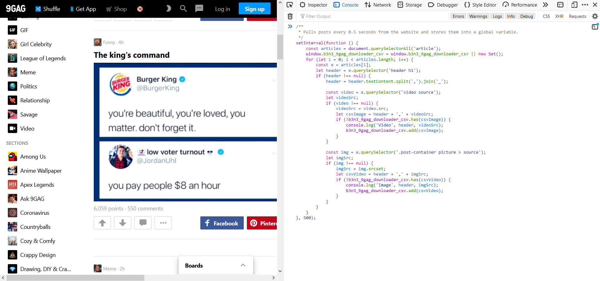

9gag Post Downloader
=======================

**These two scripts allows you to download posts from 9gag.com.**

GIFs will be stored as mp4.\
The caption of the posts will be used as filenames.

Requirements:
-------------

For [9gagDownloader.py](9gagDownloader.py) you need the following:
* [Python 3.x](https://www.python.org/downloads/)
* `requests` library\
Simply run `pip install requests` after installing Python 3.x or by running `pip install < requirements.txt`.

For [9gagExtractor.js](9gagExtractor.js) you only need:
* Google Chrome or Firefox

How to run it:
--------------

### Run the 9GAG-Extractor
First of all we have to collect a list of all posts which shall be downloaded later.\
This is done by opening the Browser Console (press *F12*) on the page where you want to download the posts.\
*Note, that this script will only download posts which have been loaded(!). So make sure, that you scroll all the way down before executing it.*

Now copy and paste the complete code from [9gagExtractor.js](9gagExtractor.js) into the browser console and press Enter.
This will start the download of a CSV file containing all the information needed for later.

   
   
### Run the 9GAG-Downloader
Now that you have the CSV in place, fire up a console and run the [9gagDownloader.py](9gagDownloader.py) script like this:\
`python 9gagDownloader.py myExportFile.csv outputDirectory`

You can now see how the script goes through all the posts and store them into the `outputDirectory`.

Hints:
======

You can try the [example.csv](example.csv) file, if you just want to check whether or not your Python setup works:\
`python 9gagDownloader.py example.csv outputDirectory`